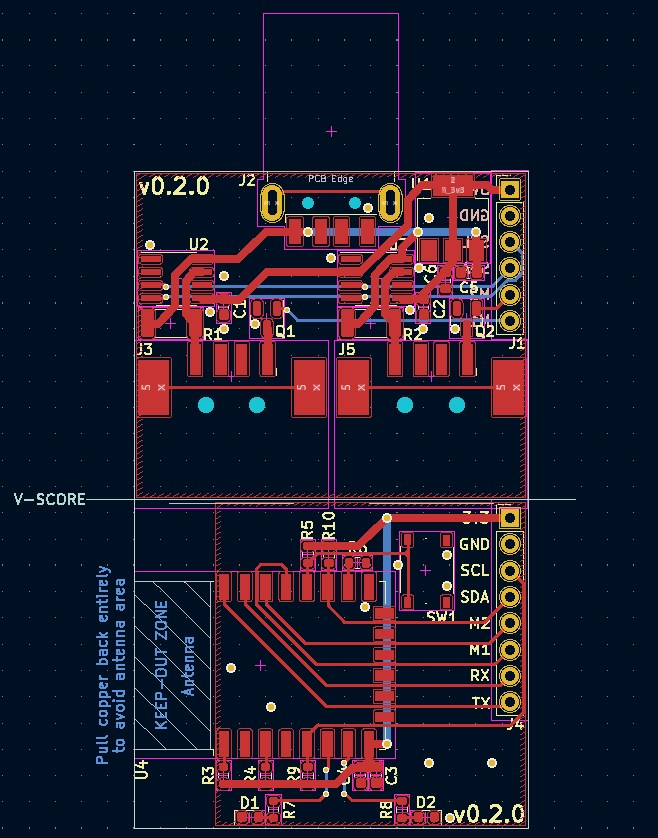

# USB Wifi Switch

This project aims to create a wifi-enabled module containing 2 individually switchable USB ports.

There are software-programmable LEDs that can be used to show the current status of each port.

## Schematics

The design is broken up into 2 parts, the MOSFET board and the Control board. In the assembled product, these are connected using headers to create a 2-layered design.

### Control Board

The control board consists of the ESP8266 module that controls the LEDs as well as the 2 MOSFETs on the MOSFET board.

### MOSFET Board

As the name implies, this is the board that holds 2 copies of the power switching circuit as well as a 3.3v regular for the Control board.

### Switch Circuits

There are 2 copies of this circuit, as shown in the MOSFET Board schematic. The switch circuit contains

## PCB

The PCB design was made as a single-sided component design, as it's easy enough for me to hand-assemble with a hot-air reflow station.

There is a v-score that is intended to be used to split the board into it's two halves and stacked with headers.

## Rendering

Currently I have an older version assembled and working on auto-charging a tablet I use as a Home Assistant dashboard. That board is v0.1.2, and does not have correct voltage reading. When I ver v0.2.0 ordered and assembled, I hope to post a photo of it.

I do have images of an even older version, v0.1, that I have since disassembled and reworked to be the v0.1.2 board that I currently use.

